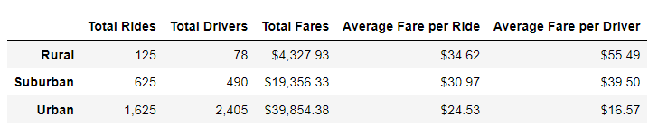
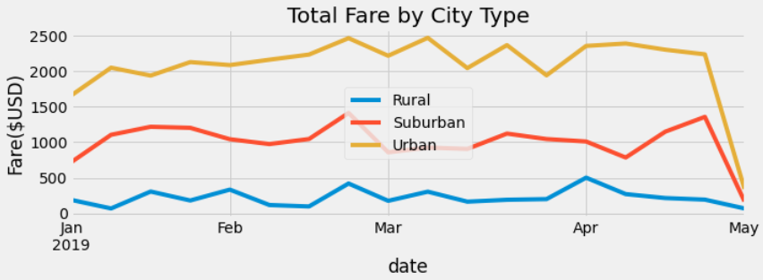

# PyBer_Analysis

## Overview:
Pyber is a ride-sharing app that hired me to examine the difference between urban, suburban, and rural cities. This data was analyzed by investigating the amount of drivers, riders, and the cost of fares for each of the city types mentioned. The initial analysis was in-depth with detail. In this project, a summary was created with the focus being the cost of fares over time for each city type.

## Results:
Below is a DataFrame that summarizes the the differences between city types. We can see that the greatest differences are between rural and urban cities. They hold either the minimum or maximum value in each category with suburban cities always in the middle. This is to be expected as urban populations are much larger than rural populations. Ergo, urban cities have the most rides, drivers, and the largest total fares. In rural cities, we find the most expensive fares per ride, and we see that because the driver "supply" is so low, the average fare per driver is very high.

There is a description of the differences in ride-sharing data among the different city types. Ride-sharing data include the total rides, total drivers, total fares, average fare per ride and driver, and total fare by city type. 

## Summary:
There is a statement summarizing three business recommendations to the CEO for addressing any disparities among the city types.

Based on the results, provide three business recommendations to the CEO for addressing any disparities among the city types.